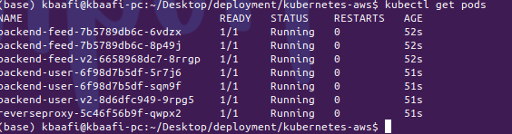
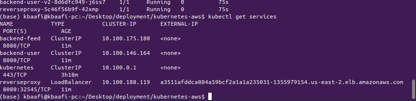
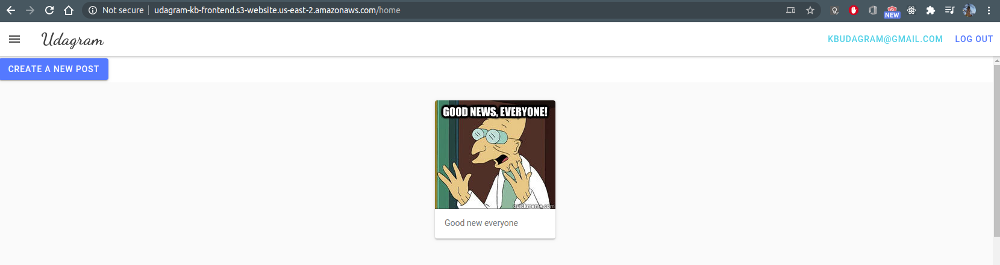

# Kubernetes Microservices Deployment

This project show cases the deployment of a microservice on AWS using Kubernetes as the container orchestration platform

## About the Application

This demo application is a simple image sharing application that allows authenticated users to login and share images. The images are displayed on the webpage in a feed like format. It must be noted that this project is more focused on the deployment of the application than the actual software development process.

## Dependencies

* kubectl
* eksctl
* AWS RDS Database
* AWS S3 static web hosting(for frontend)
* AWS S3 bucket for hosting uploaded images

## Deployment files

The deployment files for this project can be found in `deployment/kubernetes-aws`

## Starting the AWS Cluster

To create a cluster, run

```sh
    cd kubernetes-aws
    eksctl create cluster --config-file=eks-cluster-config/cluster-config.yaml
```

This create a Kubernetes cluster in a public subnet in the region specified in the config file

## Deploying the application

### 1. Volumes, Secrets and Configmaps

The configurations for these can be found in the folder `kubernetes-aws\appconfig`. It contains secrets for connecting to the database and S3 file store. To deploy these run

```sh
kubectl apply -f ./appconfig
```

### 2. Feed Service, User Service and Reverse Proxy

A reverse proxy is an Nginx webserver that  routes incoming requests between the User microservice and the Feed Microservice

First apply the pod deployments for the microservices

```sh
kubectl apply -f ./deployments
```

The running pods are shown below:


To ensure that your deployments run, make sure that the RDS database is up and running in AWS

Then apply the services

```
kubectl apply -f ./services
```

Run `kubectl get services` to reveal the deployed services. Since the reverse proxy is exposed with type=**LoadBalancer**, AWS will provision a load balancer and expose its address. 



In this case, you can reach the reverse proxy at **http://a3511afddca804a59bcf2a1a1a235031-1355979154.us-east-2.elb.amazonaws.com:8080**

### 3. Frontend

The Frontend is developed in ionic and to build it, you can run the below command. However, before you do the frontend has to be modified to point to the reverse proxy of the backend. You can edit the file `fronten/src/environment/environment.prod.ts`

```sh
ng build
```

Running the command will create a `www` output folder in the `frontend` folder. Create a hosted static website using AWS S3 to serve the frontend. Copy the contents of the `www` folder to the created bucket

For purposes of restricting access to the backend from only allowed websites, you have to modify the file `kubernetes-aws/appconfig/configmaps.yaml` to the address of the created website and apply that file.

You may need to repeat Step 2 for your changes to take effect.

## Rolling Updates

For all deployments rolling updates are employed with `maxUnavailable` set to 0, ensuring that the application is always up during state changes.

## A/B Deployment

To demonstrate A/B Deployment a direct replica of container image of the application was used. The pod deployments for v1 in both **feed** and **user** services are marked thus:

```yml
      labels:
        app: udagram
        service: backend-feed
        version: v1

```

For version 2, they are thus marked

```yml
      labels:
        app: udagram
        service: backend-feed
        version: v2
```

The service uses the selector shown below to target the pods. This way we are able to ensure that two versions of the application run at the same time.

```yml
        app: udagram
        service: backend-feed
```

The number of **v1** or **v2** targets is decided by the number of desired pods specified in each deployment.

### The running application
